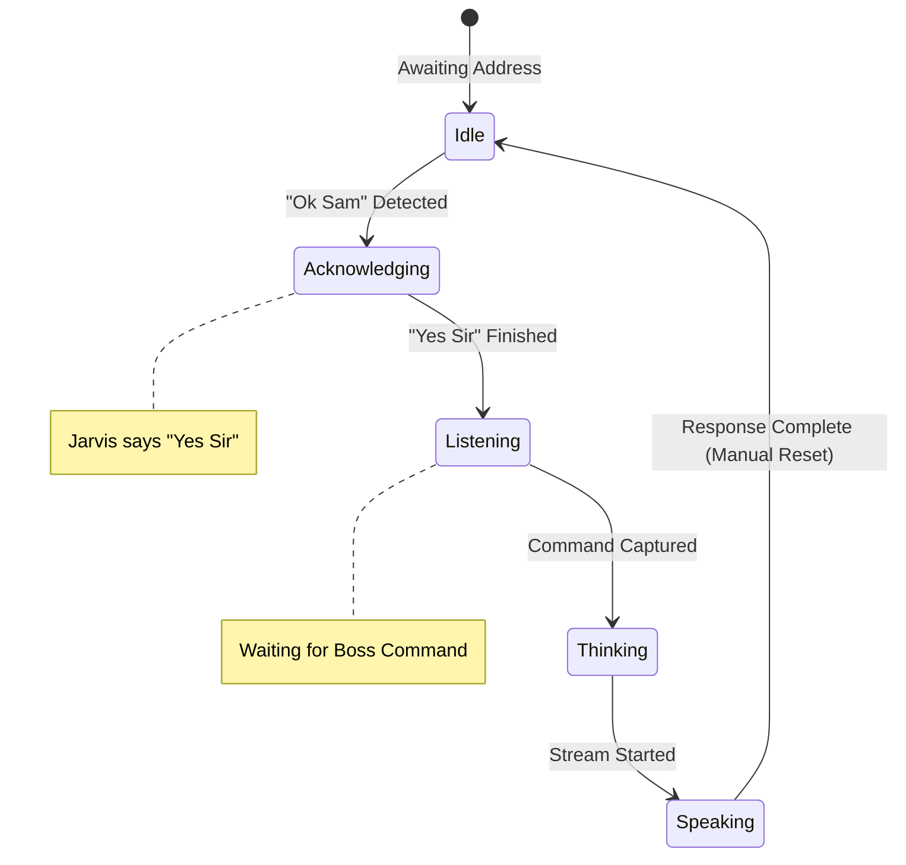

## 4-Step Interaction Protocol

This protocol ensures a rhythmic and predictable dialogue between the Boss and Jarvis.

1.  **Step 1: Boss Address**
    -   User says: *"Ok Sam"* or *"Okay Sam"*
    -   **Action**: Jarvis detects the wake word and activates **Listening Mode**.

2.  **Step 2: Jarvis Acknowledgment**
    -   Jarvis responds: *"Yes Sir"*
    -   **Action**: TTS confirms activation. Jarvis remains in **Listening Mode**, ready for the command.

3.  **Step 3: Boss Command**
    -   User says: *[The actual prompt/command]*
    -   **Action**: Jarvis captures the speech, debounces for silence, and transitions to **Thinking**.

4.  **Step 4: Jarvis Response**
    -   Jarvis: *[Ollama streaming response]*
    -   **Action**: Jarvis speaks the response. Once finished, **Listening Mode is deactivated** (returns to Idle).

---

## Technical Flow Diagram

