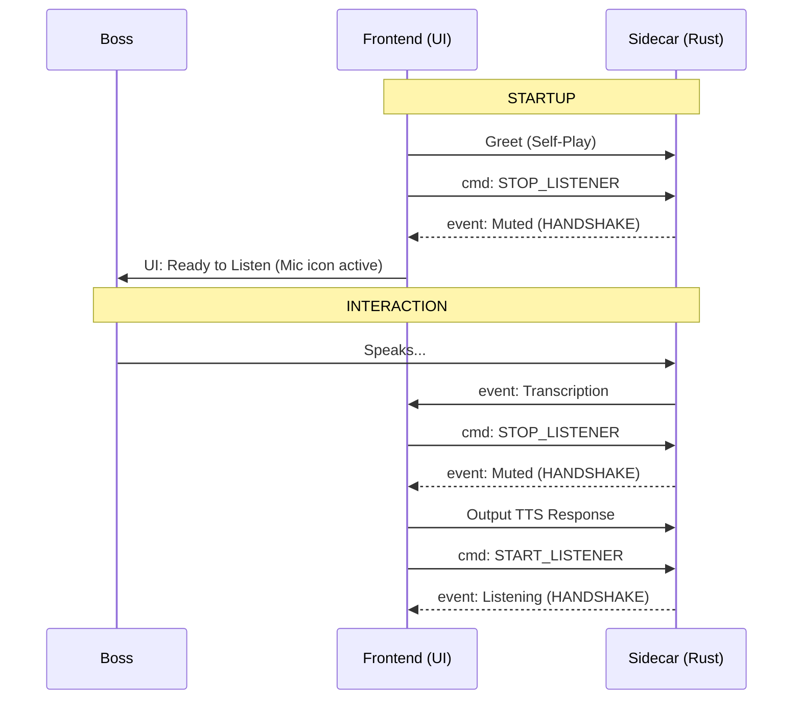

# User-Defined Strict Handshake Protocol

This document outlines the exact instructions provided for Jarvis's duplex behavior to prevent audio loops and ensure synchronization.

## 1. Startup & Initialization
- **Action**: By default, Jarvis plays the Greeting message.
- **Action**: **Immediately** after (or during) greeting, send `STOP_LISTENER` to the sidecar.
- **Constraint**: **WAIT** for physical confirmation (handshake) from the sidecar that it is stopped.
- **Outcome**: Only after confirmation is received, enable the listener in the UI so the Boss knows they can speak.

## 2. Command Processing & Response
- **Trigger**: Boss speaks and the data is processed (transcribed).
- **Action**: Send command to **SPEAK** the response.
- **Action**: **Simultaneously** send `STOP_LISTENER` to the sidecar.
- **Constraint**: **STRICT BLOCK**: The TTS engine is physically blocked from producing sound until the sidecar confirms `Muted`.
- **Outcome**: The Sidecar is guaranteed to be deaf before the first syllable of the response is played.

## 3. Visual Transparency (Chat Log)
- **Requirement**: EVERY internal action must be logged as a status message in the chat window.
- **Entries**:
    - `[SYSTEM]: Requesting Mic Lock...`
    - `[SYSTEM]: Mic Locked (Confirmed)`
    - `[SYSTEM]: Jarvis Speaking...`
    - `[SYSTEM]: Releasing Mic Lock...`
    - `[SYSTEM]: Mic Active (Confirmed)`

## Fundamental Logic (The Double-Lock)
1. **TTS BLOCK**: TTS `play()` is only called AFTER sidecar `muted` event is received.
2. **MIC BLOCK**: Mic `LISTEN` is only called AFTER TTS `onEnd` event is received AND sidecar `listening` event is confirmed.

---

## Buffer Management
- **Rule**: Keep the audio listener buffer logically cleared whenever the listener state toggles to prevent "ghost" audio snippets from being processed.

## Protocol Handshake Visualization

